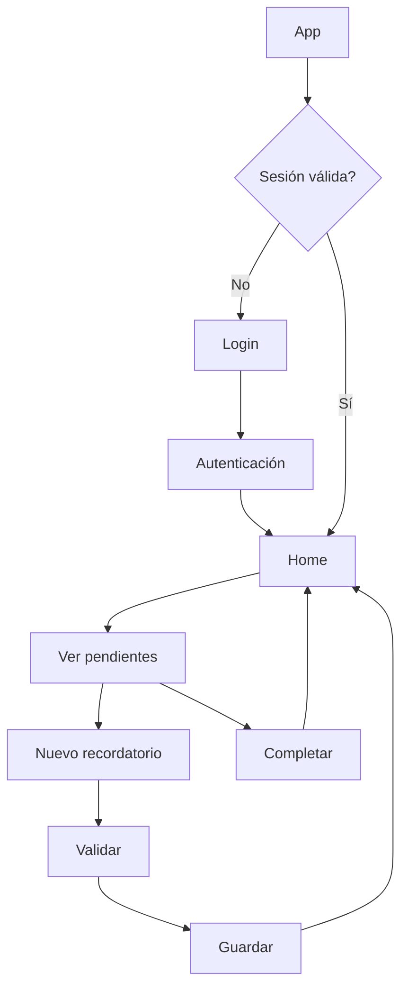
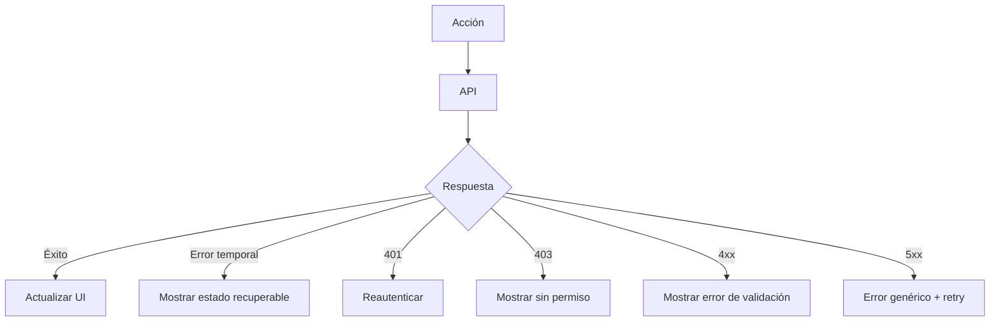
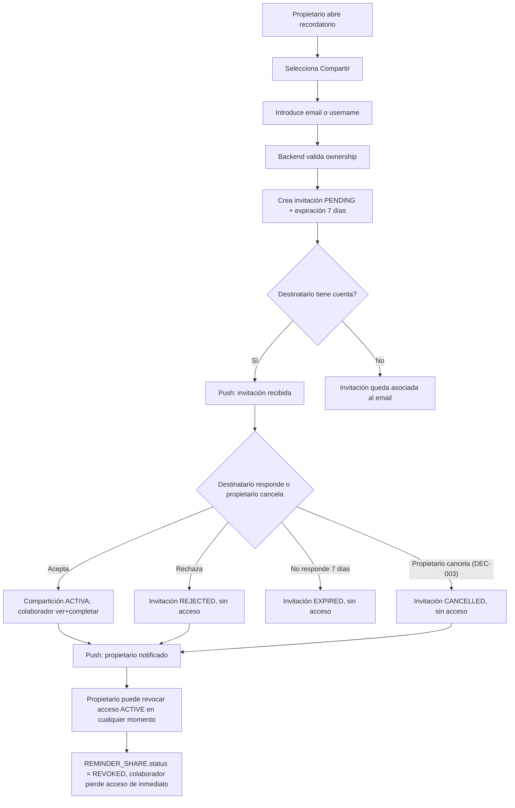
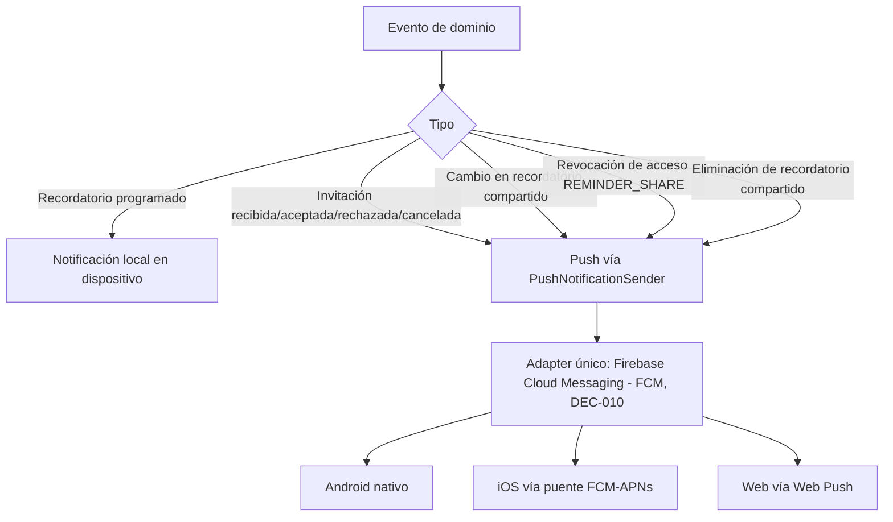

# 05 — Flujos de usuario

## Flujo principal

## Flujo de error de red

## Flujo de compartir recordatorio (invitación) — ADR-006

Nota: `CANCELLED` (invitación pendiente cancelada por el propietario, UC-14/AC-017) y `REVOKED` (colaboración ya aceptada revocada, UC-10/AC-010) son estados en entidades distintas — `INVITATION` y `REMINDER_SHARE` respectivamente — y nunca se mezclan (DEC-003).

## Flujo de notificaciones push — ADR-007/DEC-010

