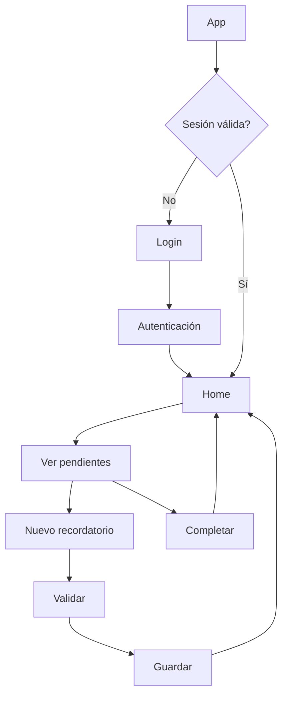
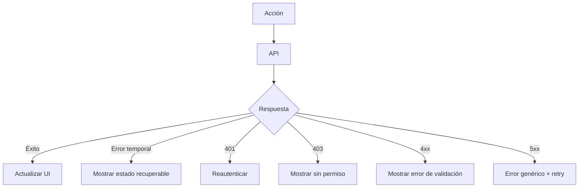
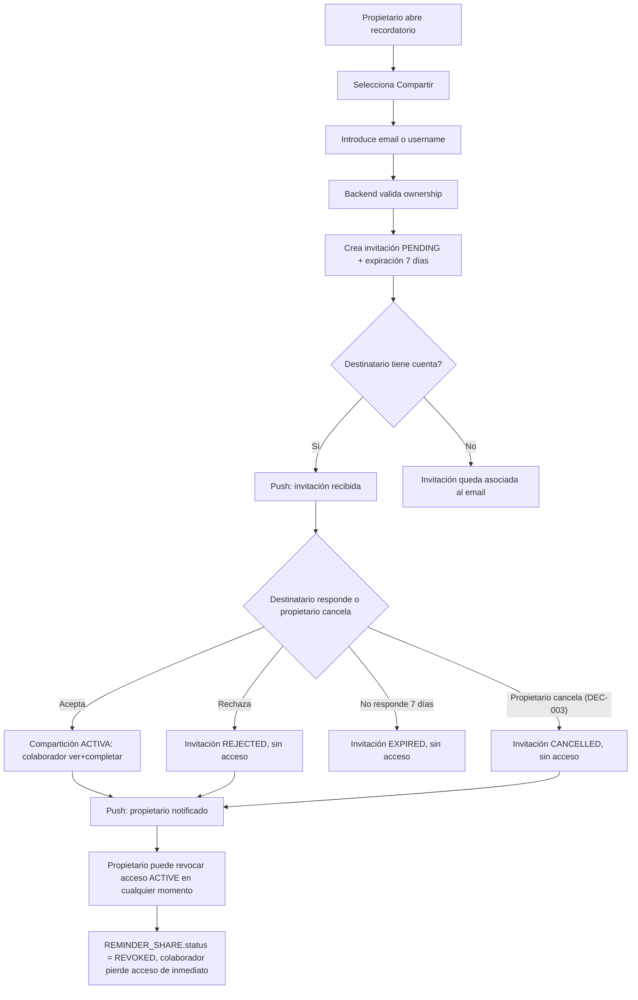
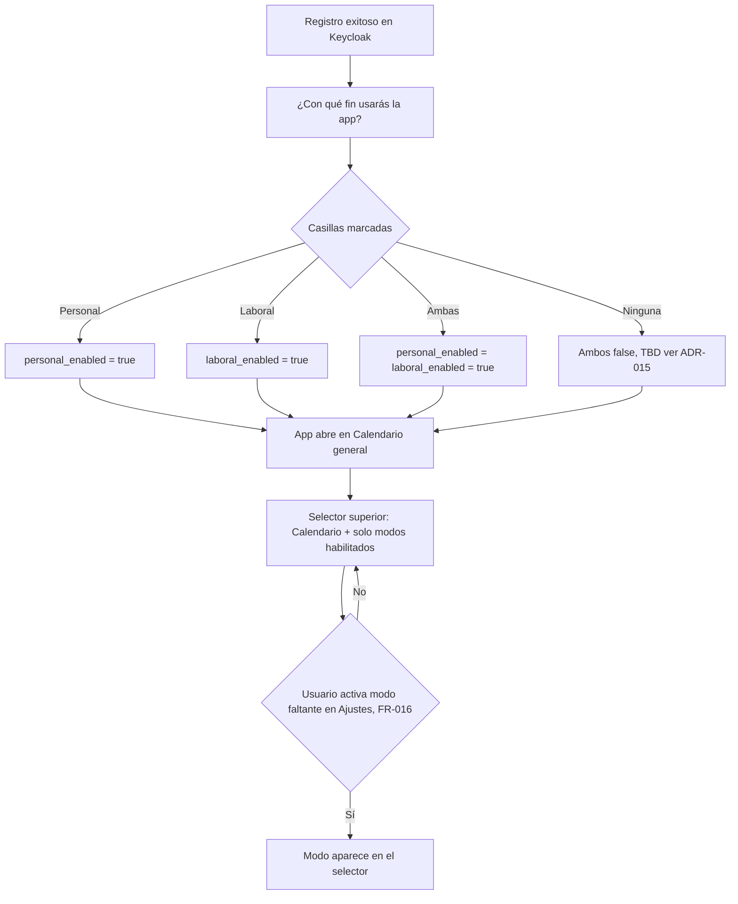
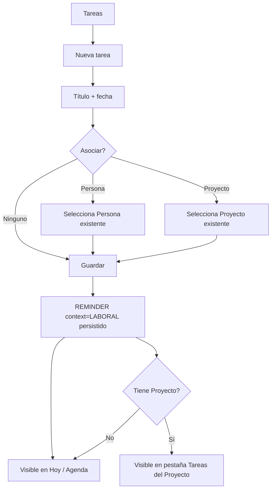
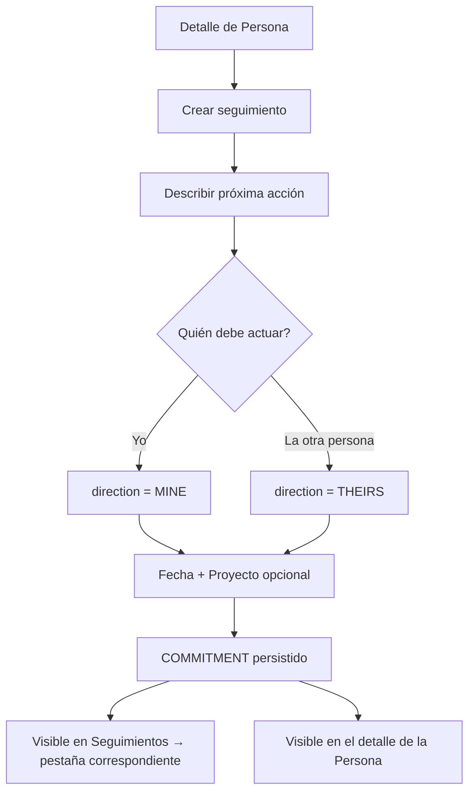
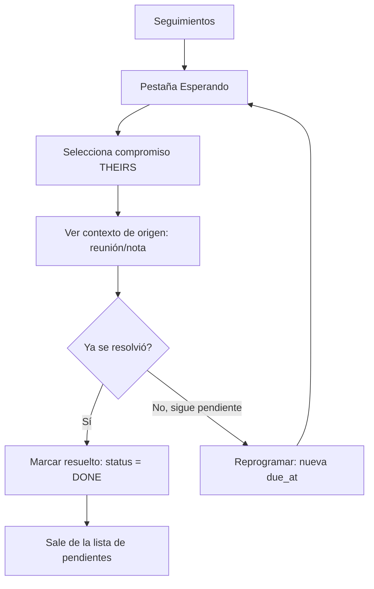
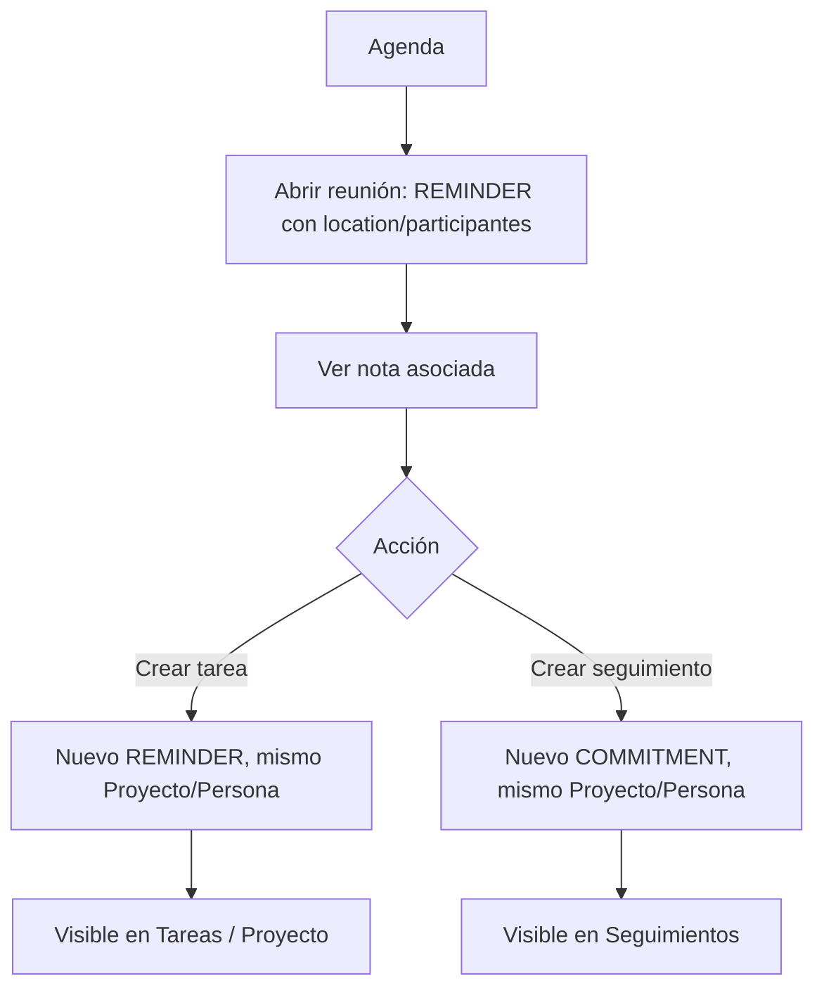
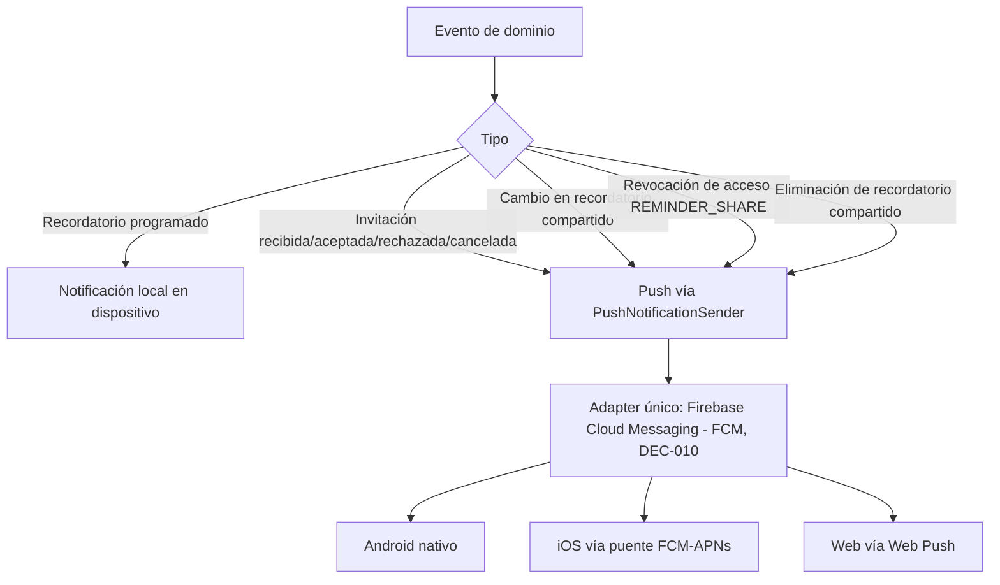

# 05 — Flujos de usuario

**Nota (ADR-015, 2026-08-18):** el destino post-login/post-registro del "Flujo principal" de abajo (paso `E[Home]`) queda superado específicamente en ese punto: desde ADR-015, la vista por defecto al abrir la app es **Calendario**, no Home. El diagrama original se conserva sin reescribir como registro histórico; ver el nuevo flujo "Registro con selección de propósito y navegación por modo" más abajo para el comportamiento vigente.

## Flujo principal

## Flujo de error de red

## Flujo de compartir recordatorio (invitación) — ADR-006

Nota: `CANCELLED` (invitación pendiente cancelada por el propietario, UC-14/AC-017) y `REVOKED` (colaboración ya aceptada revocada, UC-10/AC-010) son estados en entidades distintas — `INVITATION` y `REMINDER_SHARE` respectivamente — y nunca se mezclan (DEC-003).

## Flujo de registro con selección de propósito y navegación por modo — ADR-015

## Flujo de crear tarea vinculada (Módulo Laboral) — ADR-016, UC-17

## Flujo de seguimiento desde una Persona (Módulo Laboral) — ADR-016, UC-18

## Flujo de "Esperando" — resolver o reprogramar (Módulo Laboral) — ADR-016, UC-20

## Flujo de reunión → tareas y compromisos (Módulo Laboral) — ADR-016, UC-21

## Flujo de notificaciones push — ADR-007/DEC-010

