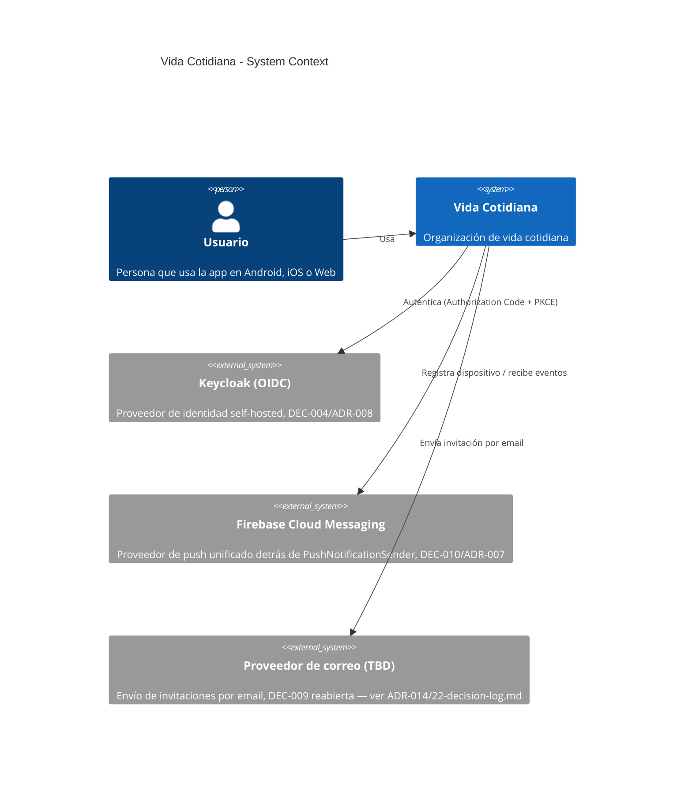
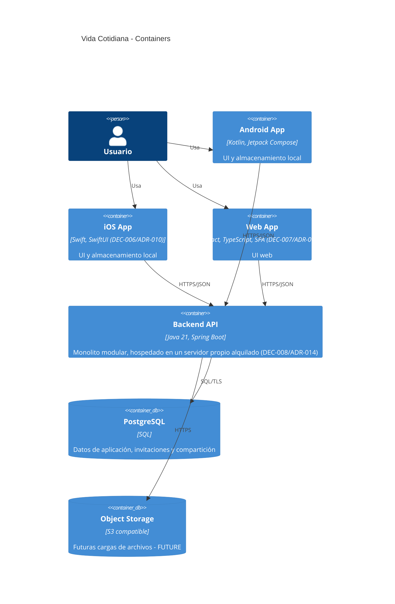

# 06 — Arquitectura C4

**DECISION (ADR-005):** V1 cubre Android, iOS y Web. Actualizado desde el diagrama inicial que solo contemplaba Android.

## Contexto

## Contenedores

## V1
- Object Storage queda preparado conceptualmente pero no se implementa (V1 no maneja archivos/adjuntos).
- iOS y Web comparten el mismo backend/API/modelo de datos que Android; no se asume código compartido entre plataformas (CLAUDE.md).
- Stack tecnológico definitivo de iOS y Web: **DECISION** (DEC-006/DEC-007) — ver `08b-ios-architecture.md` y `08c-web-architecture.md`.
- **Nota de seguridad no bloqueante:** al ser el cliente Web una SPA (DEC-007), el patrón de almacenamiento de tokens OIDC en el navegador queda como consideración técnica a resolver antes de implementar el cliente Web (ver `11-auth-security.md`); no es una decisión de negocio y no bloquea el resto de V1.
