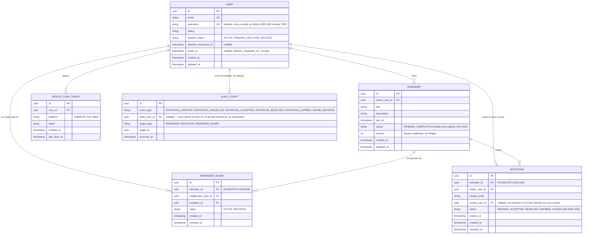

# 09 — Modelo de datos

## V1

**DECISION (ADR-006):** se añaden `REMINDER_SHARE` (colaboración activa) e `INVITATION` (invitación pendiente/resuelta) para soportar compartir un recordatorio con múltiples colaboradores (1:N), sin implementar grupos/hogares/roles.

**DECISION (DEC-001, `28-v1-decision-pack.md`):** `REMINDER.status` es un único estado global por recordatorio (`PENDING`/`COMPLETED`), compartido entre propietario y colaboradores. No existe completado individual por persona en V1.

**DECISION (DEC-005):** se añade `DEVICE_PUSH_TOKEN` para soportar múltiples dispositivos por usuario (ver ADR-007).

**DECISION (DEC-015):** `USER` incorpora campos de soft delete con periodo de gracia de 30 días.

**RECOMMENDATION (técnica, no es decisión de negocio, añadida el 2026-08-15, BE-029):** `11-auth-security.md` §Auditoría exige registrar eventos de seguridad (creación/cancelación/aceptación/rechazo/expiración de invitación, revocación de acceso) "sin guardar secretos", pero no especificaba ningún schema de tabla — este documento tampoco incluía ninguna entidad de auditoría hasta ahora. `AUDIT_EVENT` es la adición mínima para cumplir literalmente ese requisito ya aprobado; no introduce ningún requisito nuevo. Deliberadamente **sin** columna de detalle libre/JSON: los cinco campos de abajo ya bastan para lo pedido, y una columna de texto arbitrario sería la puerta de entrada exacta para que alguien termine guardando un email o un token ahí más adelante, violando "sin guardar secretos".

## Reglas
- UUID/identificador no predecible.
- FK a owner/user.
- índices sobre `user_id`/`owner_user_id`, `INVITATION(invited_email)`, `INVITATION(status, expires_at)` (para el job de expiración), `REMINDER_SHARE(collaborator_user_id)` y `DEVICE_PUSH_TOKEN(user_id)`.
- constraints de unicidad: `USER.email` único; `USER.username` único cuando no es nulo; `REMINDER_SHARE(reminder_id, collaborator_user_id)` único (evita colaboraciones duplicadas); índice único parcial `INVITATION(reminder_id, invited_email) WHERE status = 'PENDING'` (respalda el 409 de `AC-007`); `DEVICE_PUSH_TOKEN.token` único (un mismo token físico de push no debe existir en más de una fila; `POST /me/devices` actúa como upsert por `token` — si el token ya existe asociado a otro `user_id`, se reasigna al usuario autenticado actual, comportamiento normal cuando un dispositivo cambia de cuenta).
- **RECOMMENDATION (técnica, no es decisión de negocio):** `REMINDER.version` (entero, bloqueo optimista) se incrementa en cada `UPDATE` sobre el recordatorio (edición por el propietario o cambio de `status` por el propietario/un colaborador `ACTIVE`). `PATCH /reminders/{id}` y `POST /reminders/{id}/complete` deben validar la `version` enviada por el cliente contra la almacenada y responder `409` en caso de conflicto, evitando actualizaciones perdidas cuando dos actores modifican el mismo recordatorio casi simultáneamente.
- **RECOMMENDATION (técnica, no es decisión de negocio):** la transición `INVITATION.status = PENDING → ACCEPTED/REJECTED` debe ejecutarse como una actualización condicional atómica (`UPDATE ... WHERE status = 'PENDING'`) para evitar una condición de carrera si dos requests (p. ej. aceptar y rechazar, o dos aceptaciones) llegan casi simultáneamente sobre la misma invitación; solo una debe tener éxito, la otra debe recibir `410`.
- timestamps en UTC.
- migraciones versionadas con Flyway.
- **DECISION (DEC-002):** `INVITATION.reminder_id` y `REMINDER_SHARE.reminder_id` usan `ON DELETE CASCADE` — al eliminar un `REMINDER`, sus invitaciones y colaboraciones se eliminan con él. Antes de ejecutar el `DELETE` físico, el backend debe emitir una notificación push a los colaboradores con `REMINDER_SHARE.status = ACTIVE` en ese momento (ver `FR-010`, `UC-05`, `AC-013`). `REMINDER` en sí no usa soft delete (sin requerimiento que lo exija); `USER` sí, ver más abajo.
- `INVITATION.invited_email` nunca debe usarse para responder si existe o no una cuenta con ese email (mitigación de enumeración, SEC-001).
- `INVITATION.expires_at` = `created_at` + 7 días (ASSUMPTION, FR-007).
- un `REMINDER_SHARE.status = REVOKED` debe bloquear inmediatamente el acceso del colaborador (sin ventana de gracia).
- **DECISION (DEC-003):** `INVITATION.status` no incluye `REVOKED`. La revocación de acceso vive únicamente en `REMINDER_SHARE.status`.
- **DECISION (DEC-015):** al solicitar la eliminación de una cuenta, `USER.deletion_status` pasa a `PENDING_DELETION` y `purge_at` se fija a 30 días después; un job periódico purga (`deletion_status = DELETED`, anonimiza/borra datos personales) las cuentas cuyo `purge_at` ya venció. Mientras esté en `PENDING_DELETION`, el usuario puede cancelar la solicitud (revertir a `ACTIVE`) — comportamiento exacto de reversión: `TBD` de UX, no bloqueante.
- **DECISION (DEC-015, A'):** las filas de `INVITATION` en estado `REJECTED`, `EXPIRED` o `CANCELLED` deben purgar `invited_email` (o la fila completa) pasado un plazo corto de retención (ASSUMPTION: 90 días) cuando `invited_user_id` es nulo (invitado sin cuenta) — minimización de datos de terceros sin cuenta (NFR-002).
- **RECOMMENDATION (técnica, BE-029):** `AUDIT_EVENT` se escribe en la misma transacción que la operación de negocio que audita (a diferencia de push, que es best-effort) — un evento de auditoría perdido pese a que la operación tuvo éxito sería peor que no tener el log. Índices sobre `(target_type, target_id)` y sobre `occurred_at`. Sin endpoint de lectura en V1 (no está en `openapi.yaml`); es solo almacenamiento, la consulta queda fuera de alcance hasta que se decida explícitamente.
