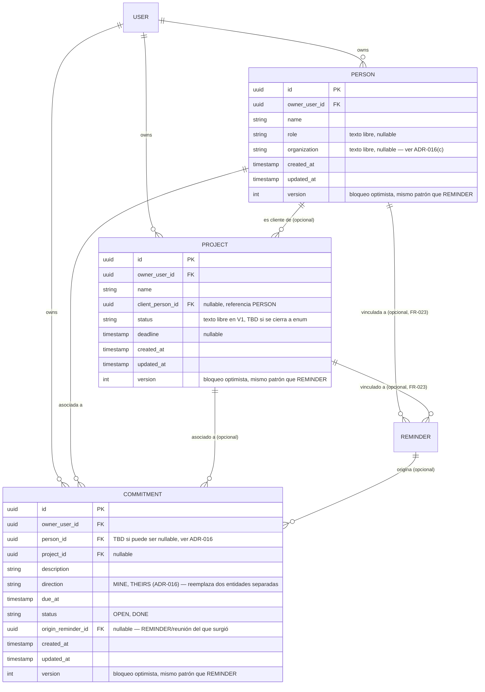
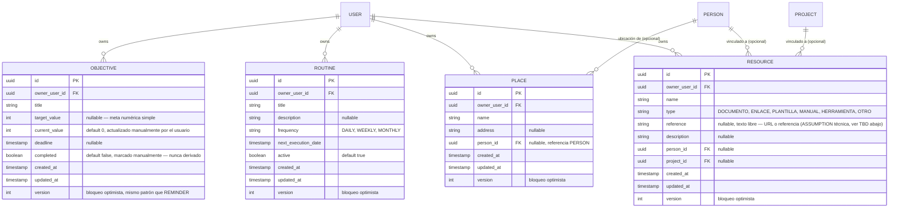

# 09 — Modelo de datos

## V1

**DECISION (ADR-006):** se añaden `REMINDER_SHARE` (colaboración activa) e `INVITATION` (invitación pendiente/resuelta) para soportar compartir un recordatorio con múltiples colaboradores (1:N), sin implementar grupos/hogares/roles.

**DECISION (DEC-001, `28-v1-decision-pack.md`):** `REMINDER.status` es un único estado global por recordatorio (`PENDING`/`COMPLETED`), compartido entre propietario y colaboradores. No existe completado individual por persona en V1.

**DECISION (DEC-005):** se añade `DEVICE_PUSH_TOKEN` para soportar múltiples dispositivos por usuario (ver ADR-007).

**DECISION (DEC-015):** `USER` incorpora campos de soft delete con periodo de gracia de 30 días.

**DECISION (ADR-015, 2026-08-18):** `USER` incorpora dos indicadores independientes de modo habilitado (`personal_enabled`, `laboral_enabled`); al menos uno debe ser `true` desde el registro (FR-014), modificables después desde Ajustes (FR-016, solo activar — desactivar queda `TBD`, ver ADR-015). `REMINDER` incorpora un campo `context` (`PERSONAL`/`LABORAL`, obligatorio) para soportar el Calendario general agregado y coloreado por origen (FR-017/FR-018). **DECISION (ADR-015/FR-019, ya no TBD):** `context` se infiere del navbar de origen al crear el recordatorio — no hay selector explícito en el formulario; el endpoint `POST /reminders` acepta un `context` opcional y por default asigna `PERSONAL` cuando el caller no lo envía (todo caller anterior a este ADR). **Version: V3, implementación adelantada en paralelo con V2** (decisión del Product Owner, 2026-08-18 — ver `05-v2-plan.md` y la nota de "Refinamiento cerrado" en `22-decision-log.md` ADR-015; esta nota reemplaza una anterior que decía "no se implementa hasta cerrar V2", ya superada).

**DECISION (Product Owner, 2026-08-18, `BE-038`) — migración de backfill real, ya aplicada:** `V6__adr015_context_modes.sql` agrega ambas columnas y resuelve los datos ya existentes en la misma migración — este fue un TBD explícito planteado antes de implementar (no asumido): todo `REMINDER` preexistente recibe `context = 'PERSONAL'`, y en la misma migración se hace *grandfather* de `personal_enabled = true` para todo `USER` preexistente (antes de este ADR la app era de un solo contexto, implícitamente personal — la migración lo reconoce explícitamente en el dato en vez de dejar una inconsistencia entre los recordatorios de un usuario y su propio selector de navegación). Verificado contra la base de datos de desarrollo real (no solo en Testcontainers): 4/4 usuarios reales quedaron con `personal_enabled = true`, 158/158 recordatorios reales quedaron con `context = 'PERSONAL'`, cero nulos.

**DECISION (usuario, 2026-08-18, `BE-037`/`WEB-009`) — Garantías y Mantenimiento pasan de mock a reales.** `WARRANTY`/`MAINTENANCE_RECORD` se agregan siguiendo el mismo patrón de `REMINDER` (Clean Architecture, dueño-únicamente, sin colaboradores — no hay concepto de compartir para estos dos), incluyendo bloqueo optimista (`version`). Los campos no se inventaron: son exactamente los que la UI mock ya mostraba (`web/src/core/mock/mockData.ts`, `WarrantiesPage.tsx`/`MaintenancePage.tsx`) antes de esta tarea — `item`, la fecha (`expires_at`/`next_due_at`, mismos nombres que ya usaba la UI), y un estado. **RECOMMENDATION técnica:** `status` (VIGENTE/POR_VENCER/VENCIDA para Warranty; AL_DIA/PROXIMO/VENCIDO para Maintenance) se deriva en el momento de la respuesta comparando la fecha contra "ahora" — no es una columna almacenada — excepto `COMPLETADO`, que sí es un estado explícito y persistido (reemplaza el toggle local-only que existía en el mock, `mockCompletedIds`, ahora una acción real `POST .../{id}/complete`). **ASSUMPTION** (no una decisión de negocio explícita, documentada como tal): "próximo a vencer" (`POR_VENCER`/`PROXIMO`) se calcula como dentro de 30 días de la fecha — ningún umbral estaba definido antes, 30 días es un valor técnico razonable, no aprobado explícitamente por el Product Owner.

**RECOMMENDATION (técnica, no es decisión de negocio, añadida el 2026-08-15, BE-029):** `11-auth-security.md` §Auditoría exige registrar eventos de seguridad (creación/cancelación/aceptación/rechazo/expiración de invitación, revocación de acceso) "sin guardar secretos", pero no especificaba ningún schema de tabla — este documento tampoco incluía ninguna entidad de auditoría hasta ahora. `AUDIT_EVENT` es la adición mínima para cumplir literalmente ese requisito ya aprobado; no introduce ningún requisito nuevo. Deliberadamente **sin** columna de detalle libre/JSON: los cinco campos de abajo ya bastan para lo pedido, y una columna de texto arbitrario sería la puerta de entrada exacta para que alguien termine guardando un email o un token ahí más adelante, violando "sin guardar secretos".

```mermaid
erDiagram
    USER ||--o{ REMINDER : owns
    USER ||--o{ REMINDER_SHARE : "es colaborador en"
    USER ||--o{ INVITATION : "recibe (si tiene cuenta)"
    USER ||--o{ DEVICE_PUSH_TOKEN : "registra"
    USER ||--o{ AUDIT_EVENT : "actor de (nullable, ver Reglas)"
    USER ||--o{ WARRANTY : owns
    USER ||--o{ MAINTENANCE_RECORD : owns
    REMINDER ||--o{ REMINDER_SHARE : "compartido con"
    REMINDER ||--o{ INVITATION : "origina"
    INVENTORY_ITEM ||--o{ WARRANTY : "cubierto por (obligatorio al crear, ADR-026)"
    INVENTORY_ITEM ||--o{ MAINTENANCE_RECORD : "se le hace (opcional, ADR-026)"
    PROJECT ||--o{ PROJECT_PARTICIPANT : "tiene"
    PERSON ||--o{ PROJECT_PARTICIPANT : "participa como"
    PERSON ||--o{ PROJECT : "es cliente de (lista DISJUNTA de la anterior)"

    USER {
      uuid id PK
      string email UK
      string username UK "nullable, único cuando se define (DEC-005 formato TBD)"
      string status
      string deletion_status "ACTIVE, PENDING_DELETION, DELETED"
      timestamp deletion_requested_at "nullable"
      timestamp purge_at "nullable, deletion_requested_at + 30 días"
      boolean personal_enabled "default false, ver FR-014/FR-016 (ADR-015)"
      boolean laboral_enabled "default false, ver FR-014/FR-016 (ADR-015)"
      timestamp created_at
      timestamp updated_at
    }
    REMINDER {
      uuid id PK
      uuid owner_user_id FK
      string title
      string description
      timestamp due_at
      string status "PENDING, COMPLETED (estado único global, DEC-001)"
      string context "PERSONAL, LABORAL (ADR-015/FR-019) — inferido del navbar de origen; default PERSONAL si el caller no lo envía"
      int version "bloqueo optimista, ver Reglas"
      timestamp created_at
      timestamp updated_at
    }
    INVITATION {
      uuid id PK
      uuid reminder_id FK "ON DELETE CASCADE"
      uuid inviter_user_id FK
      string invited_email
      uuid invited_user_id FK "nullable, se resuelve si el email coincide con una cuenta"
      string status "PENDING, ACCEPTED, REJECTED, EXPIRED, CANCELLED (DEC-003)"
      timestamp expires_at
      timestamp created_at
      timestamp resolved_at
    }
    REMINDER_SHARE {
      uuid id PK
      uuid reminder_id FK "ON DELETE CASCADE"
      uuid collaborator_user_id FK
      uuid invitation_id FK
      string status "ACTIVE, REVOKED"
      timestamp created_at
      timestamp revoked_at
    }
    DEVICE_PUSH_TOKEN {
      uuid id PK
      uuid user_id FK
      string platform "ANDROID, IOS, WEB"
      string token
      timestamp created_at
      timestamp last_seen_at
    }
    AUDIT_EVENT {
      uuid id PK
      string event_type "INVITATION_CREATED, INVITATION_CANCELLED, INVITATION_ACCEPTED, INVITATION_REJECTED, INVITATION_EXPIRED, SHARE_REVOKED"
      uuid actor_user_id FK "nullable — null cuando el actor es un job del sistema (p. ej. expiración)"
      string target_type "REMINDER, INVITATION, REMINDER_SHARE"
      uuid target_id
      timestamp occurred_at
    }
    WARRANTY {
      uuid id PK
      uuid owner_user_id FK
      string item
      timestamp expires_at
      string status "VIGENTE, POR_VENCER, VENCIDA, COMPLETADO — derivado en respuesta, ver Reglas"
      int version "bloqueo optimista, mismo patrón que REMINDER"
      timestamp created_at
      timestamp updated_at
    }
    MAINTENANCE_RECORD {
      uuid id PK
      uuid owner_user_id FK
      string item
      timestamp next_due_at
      string status "AL_DIA, PROXIMO, VENCIDO, COMPLETADO — derivado en respuesta, ver Reglas"
      int version "bloqueo optimista, mismo patrón que REMINDER"
      timestamp created_at
      timestamp updated_at
    }
```

## V3 — Módulo Laboral (ADR-016)

**DECISION (ADR-016, 2026-08-22):** se agregan tres entidades nuevas, exclusivas del contexto Laboral, y se extiende `REMINDER` con tres columnas nullable. No se crea una entidad Evento/Reunión independiente — una reunión es un `REMINDER` con `context = LABORAL`, `location` definido y participantes vía `REMINDER_SHARE` (ADR-006, ya existente, sin cambios). No se crea una entidad `ORGANIZATION`: `PERSON.organization` es texto libre en esta fase (RECOMMENDATION de minimización, NFR-011).

Columnas nuevas sobre `REMINDER` existente (mismo patrón que `context` de ADR-015 — nullable, sin romper ningún `REMINDER` preexistente):
- `person_id` (FK `PERSON`, nullable) — FR-023.
- `project_id` (FK `PROJECT`, nullable) — FR-023.
- `location` (texto, nullable) — FR-024, solo tiene sentido con `context = LABORAL`, no se restringe a nivel de base de datos (regla de negocio, no constraint).

**DOCUMENTATION_CONFLICT (detectado, no corregido en esta tarea):** `NOTE` se referencia en FR-028 (Inbox) y ya existe como recurso real en `openapi/openapi.yaml` (`/notes`), pero no aparece en el ERD de este documento — el ERD quedó desactualizado respecto al API contract en una tarea anterior a ADR-016. No se resuelve aquí para no exceder el alcance de esta decisión; queda como TBD abierto en `25-open-questions.md`.

**TBD (ADR-016):** si `COMMITMENT.person_id` admite `NULL` (compromiso sin contraparte) — ver ADR-016, TBD explícitos.

**Migración:** `V11__adr016_laboral_module.sql` — **implementada y aplicada (2026-08-22, `BE-039`)**. V7 a V10 ya estaban tomadas por trabajo posterior (notas, vision boards) para cuando esto se ejecutó; corrige la mención tentativa de "V7" de versiones anteriores de este documento. Ver `docs/development/01-technical-backlog.md` (`BE-039`).

## V4 candidato — Fase 3e (ADR-016): Objetivos / Rutinas / Lugares / Recursos

**DECISION (ADR-016, adenda Fase 3e, 2026-08-22):** se aprueba la definición funcional mínima de cuatro entidades nuevas de contexto del Módulo Laboral, divididas en cuatro incrementos independientes (3e1-3e4, ver `docs/development/08-laboral-module-plan.md`). **Ninguna está implementada todavía** — esta sección es la definición de esquema para desarrollo posterior, no una migración aplicada.

Notas por entidad:
- **OBJECTIVE:** sin relación con `PROJECT`/`PERSON` en este incremento (**FUERA DE ALCANCE** explícito, FR-031) — el progreso es 100% manual (`current_value` actualizado a mano por el usuario). Vincular a `PROJECT` para autocalcular el progreso queda como candidato futuro, no comprometido.
- **ROUTINE:** **no** genera `REMINDER`/`COMMITMENT` (decisión explícita del Product Owner, FR-032) — mantiene esta sub-fase separada de "Automatizaciones simples" (3d, sigue `BLOCKED`). "Marcar como realizada" solo avanza `next_execution_date`; no se guarda un historial de ejecuciones pasadas (no pedido).
- **PLACE:** `person_id` opcional, mismo patrón que `PROJECT.client_person_id`. No introduce `REMINDER.place_id` — la integración con `CreateTaskDialog` es solo autocompletado de texto en el cliente (FR-033).
- **RESOURCE:** no reemplaza `DOCUMENT` — sin archivo real almacenado, solo metadatos y una referencia de texto/URL (FR-034).

**TBD resueltos por el Product Owner (2026-08-28):**
- `ROUTINE`, avance de `next_execution_date` (**opción B**): se calcula desde la **fecha programada original**, nunca desde "ahora" — una rutina semanal programada el lunes y marcada el jueves pasa al lunes siguiente, no al jueves siguiente; la cadencia sobrevive a una ejecución tardía. Consecuencia declarada, no suavizada: una rutina con varias ocurrencias sin marcar sigue en el pasado tras un solo clic (un clic marca **una** ocurrencia; no se salta al futuro, eso descartaría en silencio las perdidas). Fin de mes se delega a `java.time` (31 ene + 1 mes = 28/29 feb), verificado con un test dedicado.
- `ROUTINE`, valor inicial de `next_execution_date`: **lo fija el usuario** al crear la Rutina (campo obligatorio del formulario) — el backend no deriva ninguna fecha.
- `ROUTINE`, `active = false`: la Rutina se conserva en su listado con la etiqueta "En pausa" y **no** aparece en el resumen de "Hoy" (solo se listan ahí las activas cuya fecha ya llegó).
- `RESOURCE.reference` (**opción A**): un **único campo de texto libre**, no `url` estructurada + `description` separadas. Razón registrada: varios tipos aprobados (`MANUAL`, `PLANTILLA`, `HERRAMIENTA`) a menudo no tienen URL y quedarían con un campo vacío permanente.

**TBD que siguen abiertos (no bloqueantes):**
- Punto de entrada en la UI para gestionar Lugares fuera del selector de `CreateTaskDialog` (editar/eliminar existen en la API pero no en la Web) y para ver Recursos no vinculados a ninguna Persona/Proyecto. Ninguna de las cuatro entidades se agrega al navbar de 7 secciones núcleo de Laboral (ya cerrado, `WEB-010`); Objetivos y Rutinas se alcanzan desde sus tarjetas en "Hoy".

## Reglas
- UUID/identificador no predecible.
- FK a owner/user.
- índices sobre `user_id`/`owner_user_id`, `INVITATION(invited_email)`, `INVITATION(status, expires_at)` (para el job de expiración), `REMINDER_SHARE(collaborator_user_id)` y `DEVICE_PUSH_TOKEN(user_id)`.
- constraints de unicidad: `USER.email` único; `USER.username` único cuando no es nulo; `REMINDER_SHARE(reminder_id, collaborator_user_id)` único (evita colaboraciones duplicadas); índice único parcial `INVITATION(reminder_id, invited_email) WHERE status = 'PENDING'` (respalda el 409 de `AC-007`); `DEVICE_PUSH_TOKEN.token` único (un mismo token físico de push no debe existir en más de una fila; `POST /me/devices` actúa como upsert por `token` — si el token ya existe asociado a otro `user_id`, se reasigna al usuario autenticado actual, comportamiento normal cuando un dispositivo cambia de cuenta).
- **RECOMMENDATION (técnica, no es decisión de negocio):** `REMINDER.version` (entero, bloqueo optimista) se incrementa en cada `UPDATE` sobre el recordatorio (edición por el propietario o cambio de `status` por el propietario/un colaborador `ACTIVE`). `PATCH /reminders/{id}` y `POST /reminders/{id}/complete` deben validar la `version` enviada por el cliente contra la almacenada y responder `409` en caso de conflicto, evitando actualizaciones perdidas cuando dos actores modifican el mismo recordatorio casi simultáneamente.
- **RECOMMENDATION (técnica, no es decisión de negocio):** la transición `INVITATION.status = PENDING → ACCEPTED/REJECTED` debe ejecutarse como una actualización condicional atómica (`UPDATE ... WHERE status = 'PENDING'`) para evitar una condición de carrera si dos requests (p. ej. aceptar y rechazar, o dos aceptaciones) llegan casi simultáneamente sobre la misma invitación; solo una debe tener éxito, la otra debe recibir `410`.
- timestamps en UTC.
- migraciones versionadas con Flyway.
- **DECISION (DEC-002):** `INVITATION.reminder_id` y `REMINDER_SHARE.reminder_id` usan `ON DELETE CASCADE` — al eliminar un `REMINDER`, sus invitaciones y colaboraciones se eliminan con él. Antes de ejecutar el `DELETE` físico, el backend debe emitir una notificación push a los colaboradores con `REMINDER_SHARE.status = ACTIVE` en ese momento (ver `FR-010`, `UC-05`, `AC-013`). `REMINDER` en sí no usa soft delete (sin requerimiento que lo exija); `USER` sí, ver más abajo.
- `INVITATION.invited_email` nunca debe usarse para responder si existe o no una cuenta con ese email (mitigación de enumeración, SEC-001).
- `INVITATION.expires_at` = `created_at` + 7 días (ASSUMPTION, FR-007).
- un `REMINDER_SHARE.status = REVOKED` debe bloquear inmediatamente el acceso del colaborador (sin ventana de gracia).
- **DECISION (DEC-003):** `INVITATION.status` no incluye `REVOKED`. La revocación de acceso vive únicamente en `REMINDER_SHARE.status`.
- **DECISION (DEC-015):** al solicitar la eliminación de una cuenta, `USER.deletion_status` pasa a `PENDING_DELETION` y `purge_at` se fija a 30 días después; un job periódico purga (`deletion_status = DELETED`, anonimiza/borra datos personales) las cuentas cuyo `purge_at` ya venció. Mientras esté en `PENDING_DELETION`, el usuario puede cancelar la solicitud (revertir a `ACTIVE`) — comportamiento exacto de reversión: `TBD` de UX, no bloqueante.
- **DECISION (DEC-015, A'):** las filas de `INVITATION` en estado `REJECTED`, `EXPIRED` o `CANCELLED` deben purgar `invited_email` (o la fila completa) pasado un plazo corto de retención (ASSUMPTION: 90 días) cuando `invited_user_id` es nulo (invitado sin cuenta) — minimización de datos de terceros sin cuenta (NFR-002).
- **RECOMMENDATION (técnica, BE-029):** `AUDIT_EVENT` se escribe en la misma transacción que la operación de negocio que audita (a diferencia de push, que es best-effort) — un evento de auditoría perdido pese a que la operación tuvo éxito sería peor que no tener el log. Índices sobre `(target_type, target_id)` y sobre `occurred_at`. Sin endpoint de lectura en V1 (no está en `openapi.yaml`); es solo almacenamiento, la consulta queda fuera de alcance hasta que se decida explícitamente.

## ADR-020 — Sección "Pagos" (antes "Suscripciones")

Migración `V26__payments_kind_amount_and_records.sql`. **Aditiva y sin
pérdida**: lo existente queda como `kind = SUBSCRIPTION`, sin importe, y se
comporta igual que antes.

### `SUBSCRIPTION` (tabla `subscriptions`, nombre conservado — ADR-020(e))

Campos que ya existían: `service`, `company`, `plan`, `next_payment_date`,
`billing_cycle`, `context`, `version`, timestamps.

| Campo nuevo | Tipo | Aplica a | Notas |
|---|---|---|---|
| `kind` | VARCHAR(24) NOT NULL | todos | `SUBSCRIPTION` / `SERVICE` / `MEMBERSHIP` / `CUSTOM` / `CARD` / `CREDIT`. Sin CHECK: la validación vive en el DTO, igual que `type` en `vision_board_elements` |
| `amount` | NUMERIC(12,2) | todos | Opcional. **Alcance acotado a esta sección** (ADR-020(b)) |
| `currency` | VARCHAR(3) | todos | ISO 4217, **por pago** (ADR-020(c)) |
| `payment_method` | VARCHAR(120) | todos | Texto libre |
| `notes` | VARCHAR(2000) | todos | |
| `variable_amount` | BOOLEAN NOT NULL | todos | El importe cambia cada ciclo |
| `statement_day` | INTEGER | CARD | Día del mes del corte (1-31) |
| `due_day` | INTEGER | CARD | Día del mes del límite (1-31) |
| `min_payment` | NUMERIC(12,2) | CARD | |
| `no_interest_payment` | NUMERIC(12,2) | CARD | |
| `institution` | VARCHAR(120) | CARD | |
| `last_four` | VARCHAR(4) | CARD | **Etiqueta, no dato bancario.** Nunca se guarda número completo, CVV ni titular |
| `total_installments` | INTEGER | CREDIT | |
| `current_installment` | INTEGER | CREDIT | |

`next_payment_date` en una tarjeta guarda la próxima fecha **límite**; el
corte se deriva de `statement_day` (el anterior al límite, no el siguiente).

### `PAYMENT_RECORD` (tabla `payment_records`) — nueva

| Campo | Tipo | Notas |
|---|---|---|
| `id` | UUID PK | |
| `subscription_id` | UUID NOT NULL FK → `subscriptions` | `ON DELETE CASCADE` |
| `owner_user_id` | UUID NOT NULL FK → `users` | |
| `period_date` | DATE NOT NULL | **El ciclo que se pagó**, no el día en que se marcó |
| `paid_on` | DATE NOT NULL | Cuándo lo marcó el usuario |
| `amount` | NUMERIC(12,2) | Importe **real**; puede diferir del estimado (tarjetas) |
| `currency` | VARCHAR(3) | |

Índice único `(subscription_id, period_date)`: hace idempotente "marcar como
pagado". Sin él, un doble clic o un reintento de red saltarían dos ciclos.

## ADR-021 — Mantenimiento recurrente

Migración `V27__maintenance_recurrence_log.sql`. **Aditiva**: no cambia
ninguna columna de `maintenance_records`; lo que cambia es el
comportamiento del dominio.

### `MAINTENANCE_LOG` (tabla `maintenance_log`) — nueva

| Campo | Tipo | Notas |
|---|---|---|
| `id` | UUID PK | |
| `maintenance_record_id` | UUID NOT NULL FK → `maintenance_records` | `ON DELETE CASCADE` |
| `owner_user_id` | UUID NOT NULL FK → `users` | |
| `scheduled_date` | DATE NOT NULL | La fecha que **estaba programada** al completar. Sostiene el deshacer |
| `completed_date` | DATE NOT NULL | Cuándo se hizo de verdad. Comparada con la anterior da el retraso |
| `note` | VARCHAR(500) | Opcional |

Índice único `(maintenance_record_id, scheduled_date)`: hace idempotente el
botón "Hecho".

### Reglas de recurrencia (ADR-021)

- **Con `interval_months`:** completar avanza `next_due_at` un intervalo y el
  registro sigue `ACTIVE`.
- **Vencido:** el intervalo se cuenta **desde hoy**, no desde la fecha
  incumplida — el intervalo mide desgaste, no calendario. **Diverge a
  propósito de Pagos (ADR-020)**, donde pagar tarde no corre los
  vencimientos.
- **Sin `interval_months`:** el mantenimiento es puntual; completarlo lo deja
  `COMPLETED` y no vuelve.
- **"Próximo" = 7 días**, un único umbral en backend, lista y calendario.

---

## ADR-022 — Garantías, Inventario y Documentos

### Aislamiento por módulo completado (migración V28)

La migración V25 añadió `context` a Garantías, Mantenimiento, Suscripciones y
Notas del día, y **dejó fuera Inventario y Documentos**, que se habían
construido seis días antes de que existiera la regla. V28 cierra el hueco:

| Tabla | Columna | Tipo | Regla |
|---|---|---|---|
| `inventory_items` | `context` | `VARCHAR(16) NOT NULL DEFAULT 'PERSONAL'` | ADR-019 regla 4: todo lo existente es PERSONAL |
| `documents` | `context` | `VARCHAR(16) NOT NULL DEFAULT 'PERSONAL'` | ídem |

Índices `(owner_user_id, context)` en ambas, igual que en V25.

`context` **se fija al crear y no cambia**: ni `applyEdit` ni `edit` lo tocan,
mismo criterio que en `Warranty`. En un documento compartido, `context` es el
módulo **del dueño** — el recurso pertenece al módulo desde el que se creó, no
al de quien lo recibe.

### `WARRANTY.inventory_item_id` — vínculo con Inventario

| Columna | Tipo | Regla |
|---|---|---|
| `warranties.inventory_item_id` | `UUID NULL REFERENCES inventory_items(id) ON DELETE SET NULL` | NULL = sin enlazar |

- **El vínculo vive en `warranties` y no al revés** porque la garantía es la
  que se refiere a un artículo, y así un artículo puede acumular varias a lo
  largo del tiempo (garantía de fábrica y extensión contratada aparte).
- **`ON DELETE SET NULL`, no CASCADE:** borrar el artículo del inventario no
  puede llevarse por delante el comprobante de su garantía, que puede seguir
  haciendo falta para una reclamación.
- Cuando un artículo tiene varias, la lista de Inventario muestra **la que
  vence más tarde** — es la que sigue cubriendo.
- El artículo enlazado se valida contra el **mismo dueño** (`WarrantyService`):
  enlazar con un artículo ajeno filtraría su existencia.
- **ADR-026 (2026-09-06): el enlace es OBLIGATORIO al crear.** `POST
  /warranties` exige `inventoryItemId` y `WarrantyService#create` lo valida —
  una garantía siempre cubre un artículo. La columna sigue siendo `NULL` en la
  tabla porque **la obligación no es retroactiva**: las garantías anteriores a
  la regla siguen siendo válidas y `PATCH` no la exige (también permite
  desenlazar). Se restringe lo que entra, no lo que ya está guardado.
- **ADR-026: el artículo debe ser del mismo MÓDULO**, no solo del mismo dueño.
  Hasta entonces la única defensa era que el cliente filtrara el selector —una
  decisión de cliente que una llamada directa a la API se saltaba, contra la
  regla 2 del ADR-019.

### `MAINTENANCE_RECORD.inventory_item_id` — vínculo con Inventario (V31)

| Columna | Tipo | Regla |
|---|---|---|
| `maintenance_records.inventory_item_id` | `UUID NULL REFERENCES inventory_items(id) ON DELETE SET NULL` | NULL = sin enlazar |

- **La otra mitad de la misma idea.** Con este vínculo el artículo responde
  "¿qué le toca y cuándo?" además de "¿todavía tiene garantía?". Antes "Cambio
  de aceite" y "Auto Toyota" vivían en dos listas que se ignoraban.
- **`item` se conserva y sigue siendo texto libre**: describe la TAREA ("Cambio
  de aceite"), no el objeto. Son dos datos distintos.
- **OPCIONAL, a diferencia del de la garantía** (ADR-026(c)): también se
  mantiene lo que no es un artículo inventariado —el techo, el jardín—, y
  obligarlo expulsaría casos reales.
- Cuando un artículo tiene varios, la lista de Inventario muestra el que **toca
  antes** — criterio opuesto al de la garantía, y a propósito: de una garantía
  importa la que sigue cubriendo; de un mantenimiento, el que hay que hacer ya.
- Mismas dos validaciones que la garantía: mismo dueño y mismo módulo.

### `PROJECT_PARTICIPANT` — quién está en un proyecto (V32)

| Columna | Tipo | Regla |
|---|---|---|
| `project_participants.project_id` | `UUID NOT NULL REFERENCES projects(id) ON DELETE CASCADE` | |
| `project_participants.person_id` | `UUID NOT NULL REFERENCES people(id) ON DELETE CASCADE` | |
| `project_participants.role` | `VARCHAR(32) NOT NULL` | `PROVEEDOR` \| `CONTACTO` \| `COLABORADOR` \| `OTRO` |
| — | `UNIQUE (project_id, person_id)` | Una persona, una sola vez por proyecto |

- **NO incluye al cliente.** El cliente sigue siendo `projects.client_person_id`
  (ADR-026(e): cliente y participantes **conviven**). `CLIENTE` no es un rol
  válido, y el servicio impide el solapamiento por los dos lados: no se puede
  añadir como participante a quien ya es el cliente, ni nombrar cliente a quien
  ya participa. Son dos mitades **disjuntas** de "quién está aquí"; sin esa
  disyunción habría dos verdades que acabarían discrepando.
- **Tabla y no columna** porque una persona participa en VARIOS proyectos: un
  proveedor en tres obras se duplicaría tres veces con columnas.
- **`ON DELETE CASCADE` en los dos lados**, al revés que los enlaces con el
  inventario: una participación no significa nada sin el proyecto ni sin la
  persona. Un comprobante de garantía sí sobrevive al artículo; "Ana es
  proveedora de una obra que ya no existe" no es un dato que conservar.
- El `UNIQUE` respalda el 409 de duplicado: la comprobación de lectura previa
  puede perderla una segunda petición simultánea.

### Estados de Garantía (derivados, nunca almacenados)

`warranties.status` sigue siendo de 2 valores (`ACTIVE` / `COMPLETED`). Los
cuatro estados que ve el usuario los calcula `WarrantyResponse` a partir de
ese campo y de `expires_at`:

| Estado API | Condición | Etiqueta en la interfaz |
|---|---|---|
| `VIGENTE` | `ACTIVE` y vence a más de 30 días | Vigente |
| `POR_VENCER` | `ACTIVE` y vence dentro de 30 días | Por vencer |
| `VENCIDA` | `ACTIVE` y ya venció | Vencida |
| `COMPLETADO` | `COMPLETED` | **Usada** |

**El valor del contrato sigue siendo `COMPLETADO`** (ADR-022(e)): solo cambia
la palabra que lee el usuario, porque una garantía no se "completa", se usa.
`POST /warranties/{id}/complete` **alterna**, así que también sirve para
devolverla a vigente.

### Reglas de consulta (ADR-022)

- **Contexto, categoría y búsqueda se resuelven en la CONSULTA**
  (`InventoryItemRepository#search`, `DocumentRepository#search`), nunca en el
  cliente: filtrar sobre la página ya cargada oculta resultados sin avisar en
  cuanto hay más registros que el tamaño de página.
- La consulta de Documentos **conserva la regla de visibilidad** de
  `findVisibleTo`: propios + compartidos conmigo + públicos de la familia.
- La búsqueda es `LIKE` insensible a mayúsculas sobre `name` (y `location` en
  Inventario). No hay índice de texto completo: **TBD** si el volumen lo pide.
